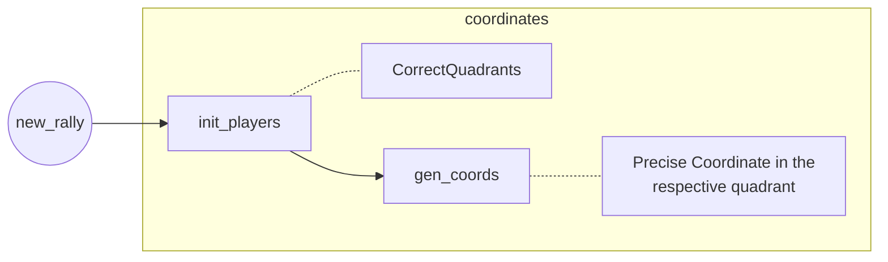

# ShuttleSim

A badminton toy-model simulator written in python.

<u>Notes for development:</u>

1. Use an agent based approach, where individual entities interact with each other.
2. Attention must be paid to a good domain model rather than efficiency considerations which should be done last.
3. Simple approaches first.
4. Periodically update the file `ubiquitous_lang.md` in the same repository.
5. The code should be maintained in sync with this document. Changes in the code structure should be accompanied with similar changes in this document.
6. During the development, only one code file (and hence one class) must be edited during each commit. The commit then packages changes  that include only one changed source code file and the README file. Commit messages should be descriptive of the changes.
7. If your changes breaks another class that you can think of, mention it in the relevant section of the file that you have edited in bold.
8. Have discussions  (short) twice a week.

---

**Maintainance Plan:**

| Player        | Assignment 1   | Assignment 2        |
| ------------- | -------------- | ------------------- |
| Yatharth      |  `class Player` | `class Court` |
| Chandrasekhar | Coordinates & Time | `class Battery` |

**Completed things:**


## Introduction


## Complexities to Resolve

1. Multi-event simulation hence a consolidated approach to store each event (in file).
2. Multiple coordinate systems and local and global references (say in regards to players and shuttle).
3. Simulation happens on multiple meshes/lattices that are loosely coupled by a shuttle object.
4. Distribution of random number streams to different stochastic entities.


## Approach with Coordinate Systems [ill-formed concept]

All coordinate systems are defined inside a class scope except for  `global_coord` system.  The coordinate systems are restricted by a list of coordinates which form its `state_space`. 

The default position assigned to each entity is the 0th position of its state space. The state spaces are immutable and must be defined using a tuple.

Example:

```python
shuttle.pos = shuttle_ss[0] # 0th shuttle state space
```


## Approach with Faults

All faults are unified into a single `FaultEvent`. Generation of this event causes a point to be generated for the opposite team. 

[Maybe] : In comparison, a `RallyEvent` is generated when the shuttle is successfully returned to the court of the opponent team.


# Classes & functions

## Shuttle

It is a bi-modal object that is - `{active, inactive}`.  A player entity which makes the shuttle inactive looses a point. An inactive shuttle also generates a new rally event. 

The position and activity of the shuttle is set by the player who is hitting it. The shuttle also stores the player that hits the last shuttle and the side of the hitting.


## function Rally

Agent interaction takes place in the scope of a `Rally`. A rally is generated until one of the teams gets to the `GamePoint + 1`. The occurrence of `Deuce` , where the `GamePoint` is incremented to the appropriate value at runtime. Since, Deuce require special handling, for the first implementation, the occurrence of the first event generates a `DrawEvent`.

#### Moves performed:

1. Shuttle is moved by the `hitter`.

2. The `receiver` moves to hit the shuttle, while the other players maintain their positions. 
3.  Hence, its either the shuttle or the `rule` object that moves the players.

The construction of a rally in pseudocode:

The following are the relevant player entities during a single `ShotEvent`:

1. `playerA` or `hitter`.
2. `playerB` or `receiver`

```python
#Initalize players to their rule-generated position
#Select seving team and server -> playerA
#receiver is assigned the alias -> playerB

# Loop shot events
current_side = court.rules.get_serving_side()
hitter = court.rules.get_server()

shots_count = 0
while shuttle.activity:
	# PlayerA sets the state of the shuttle
	shuttle.register(current_side, hitter)
	shuttle.set_state(playerA.generate_shuttle_state())
	shuttle.set_new_pos(playerA.generate_shuttle_pos()) #Always in the other side
	# Shuttle has been released by playerA
	
	#playerB receives shuttle
	
	#Determine who takes the shot by minimizing shuttle position.
	#Side note - In future, uncertainity can be implemented by parsing this arguement to a Bernoulli dist 
		receiver = np.minarg(receiver_side.get_players_pos() - shuttle.pos)
	
	if not shuttle.activity:
		break
		
	else:
		hitter = receiver #receiver becomes the hitter
        current_side = not current_side #toggle current side
        shots_count = shot_count + 1
        #Move the current player near the current shuttle position
        

#Shuttle is inactive on one of the sides
score[not current_team] = score[not current_side] #Assign point to the winning team
	
```

   ## function Game Manager

This function manages the generation of rallies.

```python
if max(score) = court.rule.game_point + 1:
    end_match = True
	call_scores()

else:
    rally()

```

## class Player

TODO

## class Court

The court is composed of two `team`s that occupy opposite sides of the court. Each team has two `sides`. The players are assigned to the two sides at the time of the rally but are allowed to move freely within their sides.

#### class? Team & Side

Each side is a `y*x`(in accordance with numpy axis jargon) integer matrix (or mesh). The current implementation of the `team_mesh` will not contain any defined regions except the sides. Each side just divides the `team_mesh` into two - `x2`.

The players during the start of the rally will be assigned stochastically within their side boundaries. It should also be noted that one player occupies one unique integer coordinate within the team bounds. States in which both the teams occupy a single coordinate must be identified and eliminated.

The team will be defined using a 2D-numpy array and the sides can be defined simply by the slicing operator of numpy - slicing x (axis=1) into two regions for implementations.


## Micro-details

#### PRNG Usage

Use the numpy backend for now and use time as seed for now. The seed must be then saved to the Metadata object.

#### Event Tagging Stages during development

0. Initially events will not be stored.
1. Only macro-events will be stored - `team` ,`hitter`, `receiver`, `score`.
2. Saving of micro-events for capturing the whole dynamics - player positions, shuttle positions, shuttle activity, etc.
3. Final stages - each micro-process in the simulation generates an event. The `Event` will be generated which will be an `enum` and will be recorded. The saving of events to file should be done in such a way that the macro-events are saved differently, however, if complete dynamics is to be replicated - all the files must work in unision.

The event tagging may be done using the `MetaData` object that will soon include an `EventTagging` feature: https://gist.github.com/yatharthb97/1110a1924d8d70ef8ad444f12a952de6 .

#### File Generation

File name generation should be done using the `DataStore.new(filename)` function. `DataStore` class: https://gist.github.com/yatharthb97/a0b3a2665f065d982e7b0e2b2dd274b0 .


```python
def new_rally():
		# → It assigns service
		self.init_players() #Assume → Players hold the correct quadrants
       
		# → It generates new coordinates
        fourquads = self.gen_coords() # Assign Precise Co-ordinates within the quadrants
		
        # Place Shuttle
        self.shuttle.translate_to(self.server.pos())
        
		# → It calculates "norm" for the two players. min() → assigns player
		# → 
		# → Player.step(new_pos, rnd_) ==> Player return success status back to court
		# → Either the court continues the ralley
		# → Or assigns points and prepes new ralley
```




